# Kenya Wallpapers

A collection of wildlife photos taken on a trip to Kenya in 2013, resized for use as desktop wallpapers.

Filenames are Swahili translations coutesy of [glosbe.com](https://glosbe.com/en/sw/). 

Words were chosen based on the subject of the image, "E" for elephants, "M" for monkeys, etc. 

If you enjoy these images, consider donating to the Sheldrick Wildlife Trust, a charity that helps protect elephants and other wildlife in Kenya. 

https://www.sheldrickwildlifetrust.org/donate/ 

### Available Resolutions

| Aspect Ratio | Resolutions                                   | Images |
|--------------|-----------------------------------------------|------------------|
| 16:9         | 1920x1080 (FHD), 2560x1440 (QHD), 3840x2160 (4K) | 1-16               |
| 21:9         | 2520x1080 (UWFHD), 3360x1440 (UWQHD)        |   1-16               |
| 16:10        | 1920x1200 (WUXGA), 2560x1600 (WQXGA), 3840x2400 (WQUXGA)* |    1-16              |
| 32:9         | 6599x1856                                    | 17-18                |
| 9:16         | 1080x1920 (FHD), 1440x2560 (QHD), 2160x3840 (4K) | 19-23               |

\* some exceptions for WQUXGA.

### 1. Chakubimbi (liar, troublemaker)
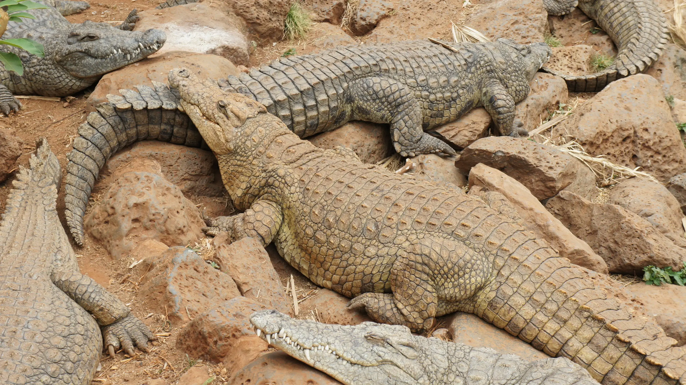
16:9: [FHD](16x9/1920x1080/FHD_Chakubimbi.jpg) [QHD](16x9/2560x1440/QHD_Chakubimbi.jpg) [4K](16x9/3840x2160/4K_Chakubimbi.jpg)
| 21:9: [UWFHD](21x9/2520x1080/UWFHD_Chakubimbi.jpg) [UWQHD](21x9/3360x1440/UWQHD_Chakubimbi.jpg)
| 16:10: [WUXGA](16x10/1920x1200/WUXGA_Chakubimbi.jpg) [WQXGA](16x10/2560x1600/WQXGA_Chakubimbi.jpg) [WQUXGA](16x10/3840x2400/WQUXGA_Chakubimbi.jpg)

### 2. Chakula (food)
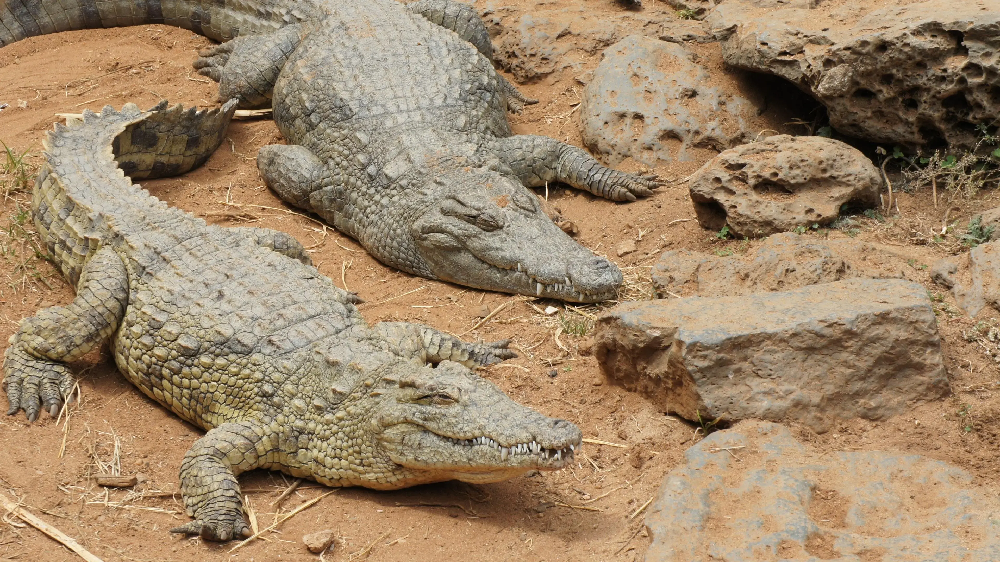
16:9: [FHD](16x9/1920x1080/FHD_Chakula.jpg) [QHD](16x9/2560x1440/QHD_Chakula.jpg) [4K](16x9/3840x2160/4K_Chakula.jpg)
| 21:9: [UWFHD](21x9/2520x1080/UWFHD_Chakula.jpg) [UWQHD](21x9/3360x1440/UWQHD_Chakula.jpg)
| 16:10: [WUXGA](16x10/1920x1200/WUXGA_Chakula.jpg) [WQXGA](16x10/2560x1600/WQXGA_Chakula.jpg)

### 3. Eka (acre)
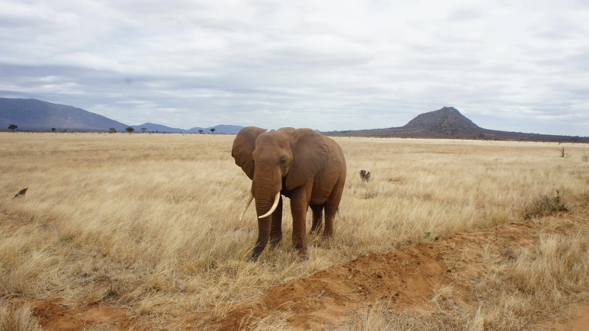
16:9: [FHD](16x9/1920x1080/FHD_Eka.jpg) [QHD](16x9/2560x1440/QHD_Eka.jpg) [4K](16x9/3840x2160/4K_Eka.jpg)
| 21:9: [UWFHD](21x9/2520x1080/UWFHD_Eka.jpg) [UWQHD](21x9/3360x1440/UWQHD_Eka.jpg)
| 16:10: [WUXGA](16x10/1920x1200/WUXGA_Eka.jpg) [WQXGA](16x10/2560x1600/WQXGA_Eka.jpg) [WQUXGA](16x10/3840x2400/WQUXGA_Eka.jpg)

### 4. Ekolojia (ecology)
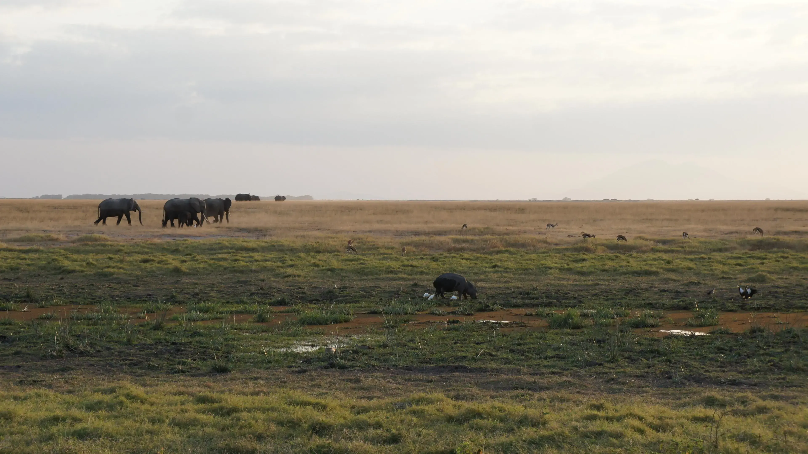
16:9: [FHD](16x9/1920x1080/FHD_Ekolojia.jpg) [QHD](16x9/2560x1440/QHD_Ekolojia.jpg) [4K](16x9/3840x2160/4K_Ekolojia.jpg)
| 21:9: [UWFHD](21x9/2520x1080/UWFHD_Ekolojia.jpg) [UWQHD](21x9/3360x1440/UWQHD_Ekolojia.jpg)
| 16:10: [WUXGA](16x10/1920x1200/WUXGA_Ekolojia.jpg) [WQXGA](16x10/2560x1600/WQXGA_Ekolojia.jpg) [WQUXGA](16x10/3840x2400/WQUXGA_Ekolojia.jpg)

### 5. Eneo (area)
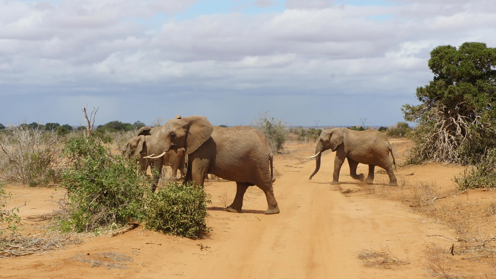
16:9: [FHD](16x9/1920x1080/FHD_Eneo.jpg) [QHD](16x9/2560x1440/QHD_Eneo.jpg) [4K](16x9/3840x2160/4K_Eneo.jpg)
| 21:9: [UWFHD](21x9/2520x1080/UWFHD_Eneo.jpg) [UWQHD](21x9/3360x1440/UWQHD_Eneo.jpg)
| 16:10: [WUXGA](16x10/1920x1200/WUXGA_Eneo.jpg) [WQXGA](16x10/2560x1600/WQXGA_Eneo.jpg) [WQUXGA](16x10/3840x2400/WQUXGA_Eneo.jpg)

### 6. Embe (mango)
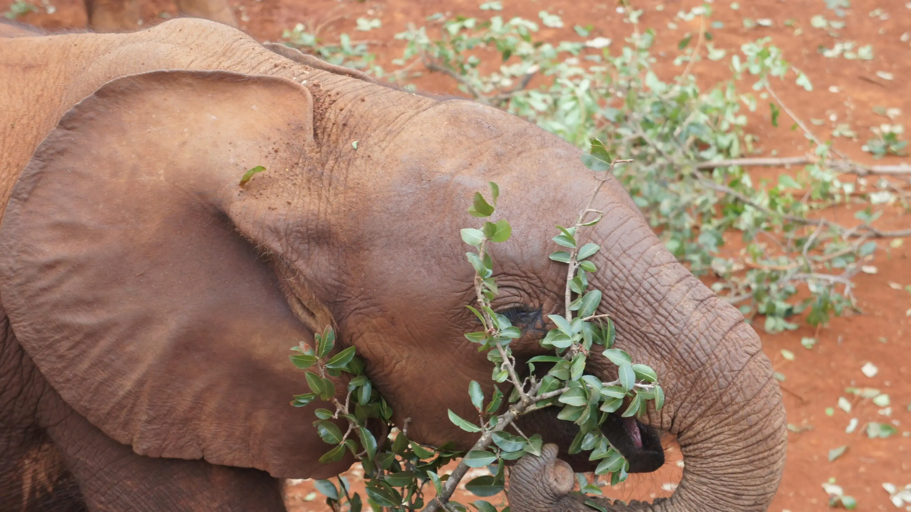
16:9: [FHD](16x9/1920x1080/FHD_Embe.jpg) [QHD](16x9/2560x1440/QHD_Embe.jpg) [4K](16x9/3840x2160/4K_Embe.jpg)
| 21:9: [UWFHD](21x9/2520x1080/UWFHD_Embe.jpg) [UWQHD](21x9/3360x1440/UWQHD_Embe.jpg)
| 16:10: [WUXGA](16x10/1920x1200/WUXGA_Embe.jpg) [WQXGA](16x10/2560x1600/WQXGA_Embe.jpg) [WQUXGA](16x10/3840x2400/WQUXGA_Embe.jpg)

### 7. Enda (to go)
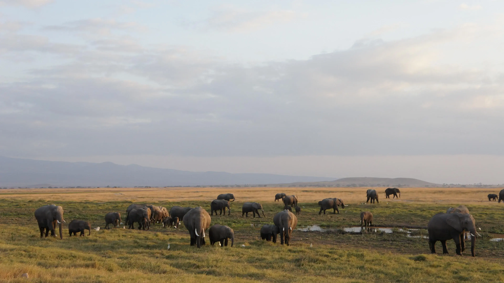
16:9: [FHD](16x9/1920x1080/FHD_Enda.jpg) [QHD](16x9/2560x1440/QHD_Enda.jpg) [4K](16x9/3840x2160/4K_Enda.jpg)
| 21:9: [UWFHD](21x9/2520x1080/UWFHD_Enda.jpg) [UWQHD](21x9/3360x1440/UWQHD_Enda.jpg)
| 16:10: [WUXGA](16x10/1920x1200/WUXGA_Enda.jpg) [WQXGA](16x10/2560x1600/WQXGA_Enda.jpg) [WQUXGA](16x10/3840x2400/WQUXGA_Enda.jpg)

### 8. Endelea (progress, to continue)
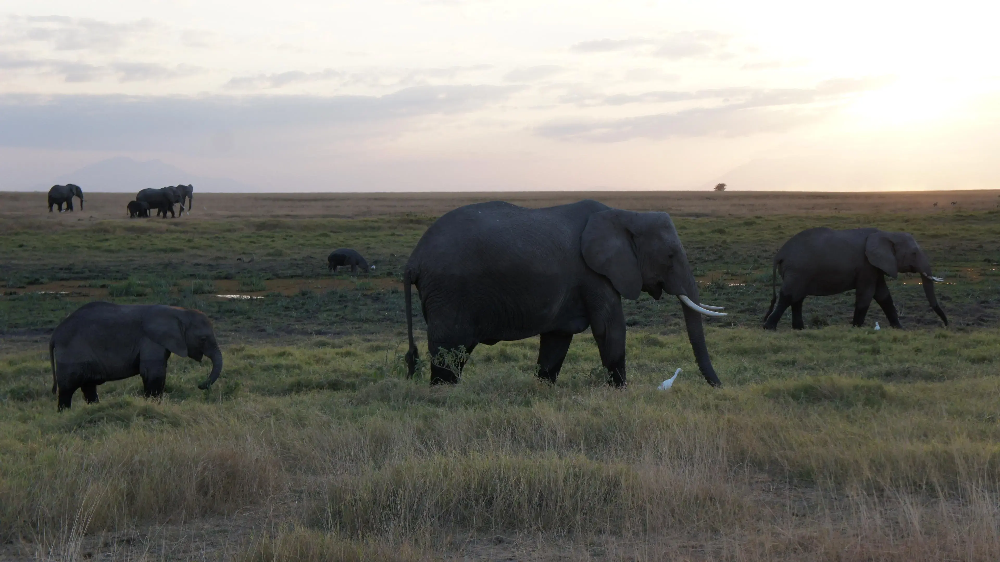
16:9: [FHD](16x9/1920x1080/FHD_Endelea.jpg) [QHD](16x9/2560x1440/QHD_Endelea.jpg) [4K](16x9/3840x2160/4K_Endelea.jpg)
| 21:9: [UWFHD](21x9/2520x1080/UWFHD_Endelea.jpg) [UWQHD](21x9/3360x1440/UWQHD_Endelea.jpg)
| 16:10: [WUXGA](16x10/1920x1200/WUXGA_Endelea.jpg) [WQXGA](16x10/2560x1600/WQXGA_Endelea.jpg) [WQUXGA](16x10/3840x2400/WQUXGA_Endelea.jpg)

### 9. Endesha (to drive)
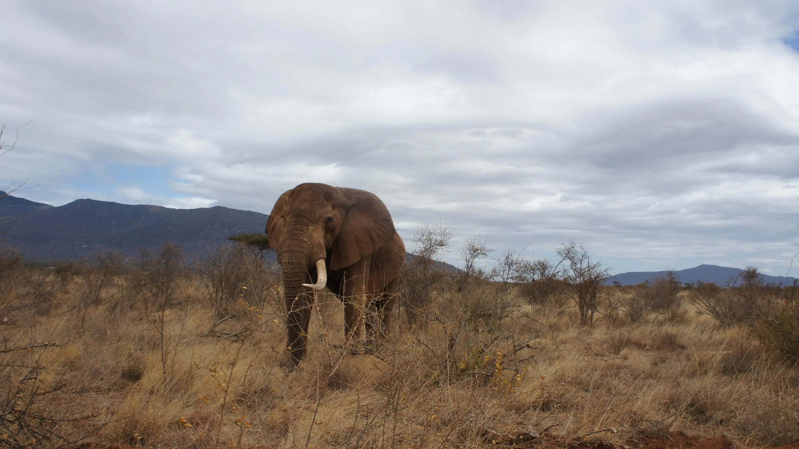
16:9: [FHD](16x9/1920x1080/FHD_Endesha.jpg) [QHD](16x9/2560x1440/QHD_Endesha.jpg) [4K](16x9/3840x2160/4K_Endesha.jpg)
| 21:9: [UWFHD](21x9/2520x1080/UWFHD_Endesha.jpg) [UWQHD](21x9/3360x1440/UWQHD_Endesha.jpg)
| 16:10: [WUXGA](16x10/1920x1200/WUXGA_Endesha.jpg) [WQXGA](16x10/2560x1600/WQXGA_Endesha.jpg) [WQUXGA](16x10/3840x2400/WQUXGA_Endesha.jpg)

### 10. Ewe (you there)
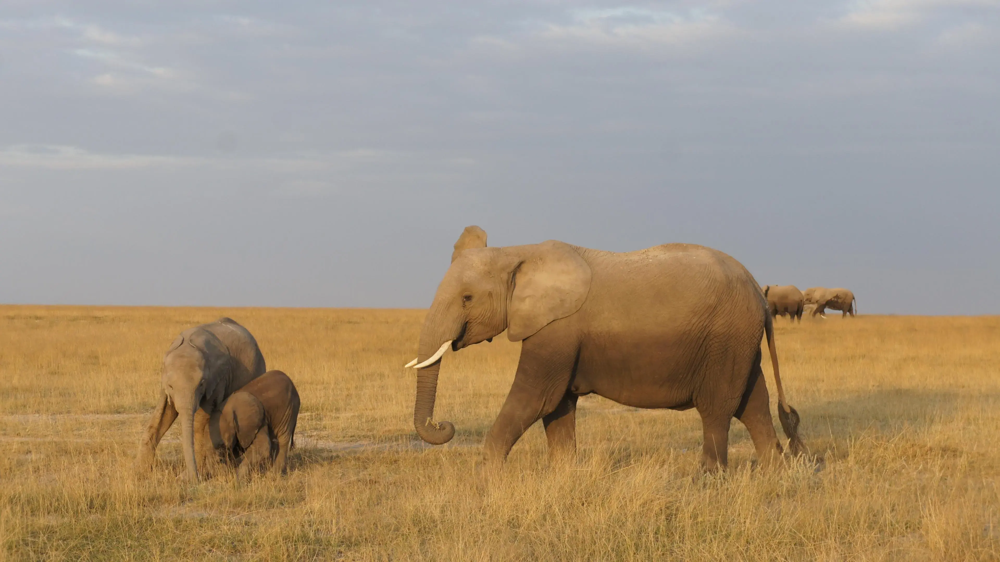
16:9: [FHD](16x9/1920x1080/FHD_Ewe.jpg) [QHD](16x9/2560x1440/QHD_Ewe.jpg) [4K](16x9/3840x2160/4K_Ewe.jpg)
| 21:9: [UWFHD](21x9/2520x1080/UWFHD_Ewe.jpg) [UWQHD](21x9/3360x1440/UWQHD_Ewe.jpg)
| 16:10: [WUXGA](16x10/1920x1200/WUXGA_Ewe.jpg) [WQXGA](16x10/2560x1600/WQXGA_Ewe.jpg) [WQUXGA](16x10/3840x2400/WQUXGA_Ewe.jpg)

### 11. Fauka (more than)
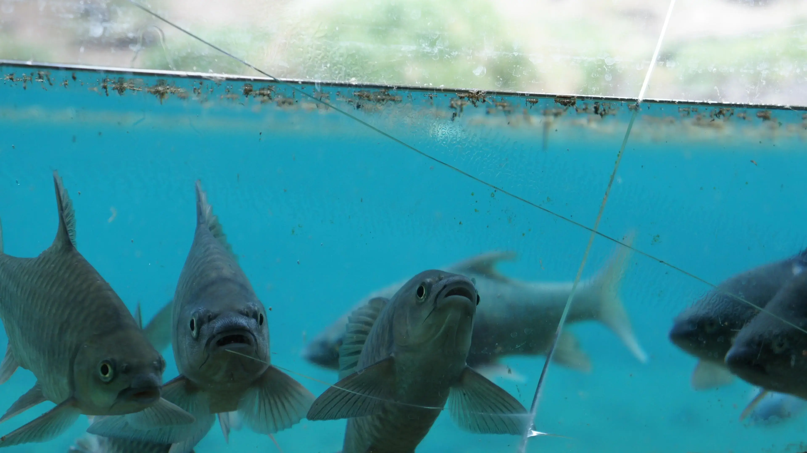
16:9: [FHD](16x9/1920x1080/FHD_Fauka.jpg) [QHD](16x9/2560x1440/QHD_Fauka.jpg) [4K](16x9/3840x2160/4K_Fauka.jpg)
| 21:9: [UWFHD](21x9/2520x1080/UWFHD_Fauka.jpg) [UWQHD](21x9/3360x1440/UWQHD_Fauka.jpg)
| 16:10: [WUXGA](16x10/1920x1200/WUXGA_Fauka.jpg) [WQXGA](16x10/2560x1600/WQXGA_Fauka.jpg)

### 12. Gubeti (figurehead)
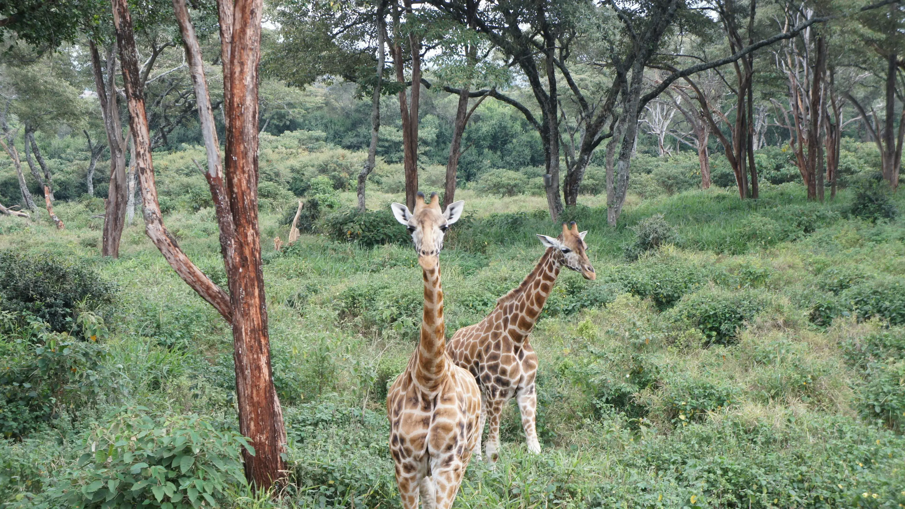
16:9: [FHD](16x9/1920x1080/FHD_Gubeti.jpg) [QHD](16x9/2560x1440/QHD_Gubeti.jpg) [4K](16x9/3840x2160/4K_Gubeti.jpg)
| 21:9: [UWFHD](21x9/2520x1080/UWFHD_Gubeti.jpg) [UWQHD](21x9/3360x1440/UWQHD_Gubeti.jpg)
| 16:10: [WUXGA](16x10/1920x1200/WUXGA_Gubeti.jpg) [WQXGA](16x10/2560x1600/WQXGA_Gubeti.jpg) [WQUXGA](16x10/3840x2400/WQUXGA_Gubeti.jpg)

### 13. Maji (water)
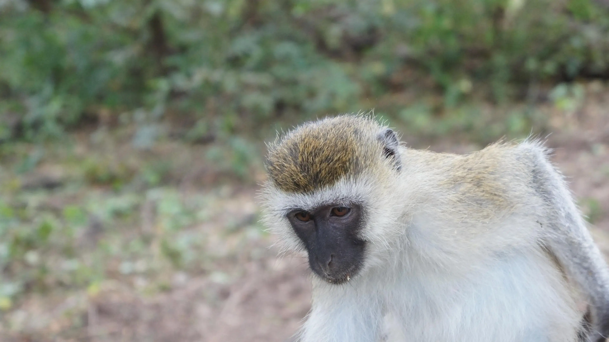
16:9: [FHD](16x9/1920x1080/FHD_Maji.jpg) [QHD](16x9/2560x1440/QHD_Maji.jpg) [4K](16x9/3840x2160/4K_Maji.jpg)
| 21:9: [UWFHD](21x9/2520x1080/UWFHD_Maji.jpg) [UWQHD](21x9/3360x1440/UWQHD_Maji.jpg)
| 16:10: [WUXGA](16x10/1920x1200/WUXGA_Maji.jpg) [WQXGA](16x10/2560x1600/WQXGA_Maji.jpg)

### 14. Mtu (person)
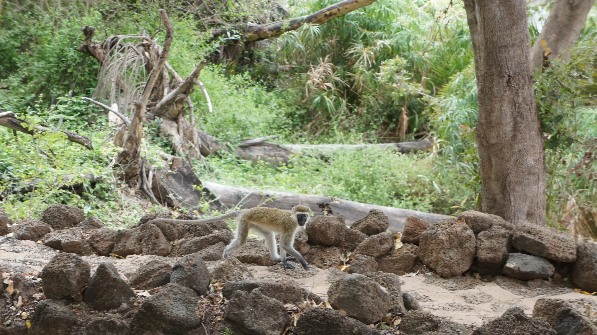
16:9: [FHD](16x9/1920x1080/FHD_Mtu.jpg) [QHD](16x9/2560x1440/QHD_Mtu.jpg) [4K](16x9/3840x2160/4K_Mtu.jpg)
| 21:9: [UWFHD](21x9/2520x1080/UWFHD_Mtu.jpg) [UWQHD](21x9/3360x1440/UWQHD_Mtu.jpg)
| 16:10: [WUXGA](16x10/1920x1200/WUXGA_Mtu.jpg) [WQXGA](16x10/2560x1600/WQXGA_Mtu.jpg)

### 15. Zuri (beautiful)
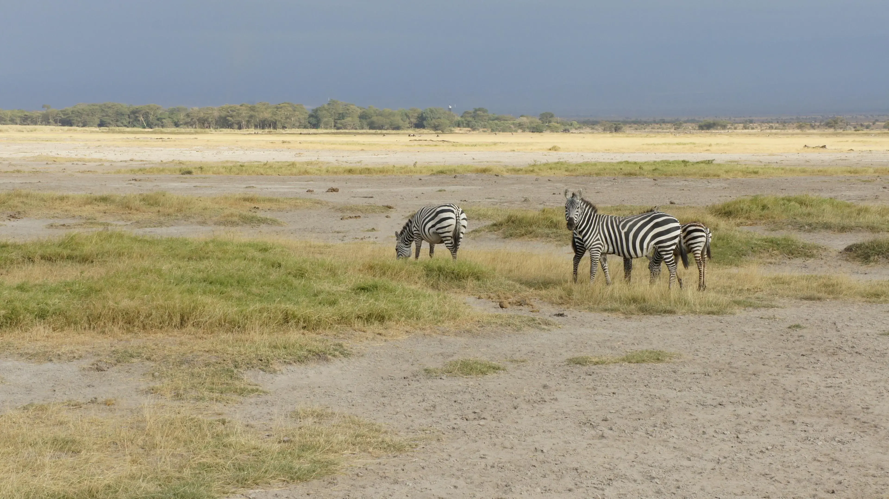
16:9: [FHD](16x9/1920x1080/FHD_Zuri.jpg) [QHD](16x9/2560x1440/QHD_Zuri.jpg) [4K](16x9/3840x2160/4K_Zuri.jpg)
| 21:9: [UWFHD](21x9/2520x1080/UWFHD_Zuri.jpg) [UWQHD](21x9/3360x1440/UWQHD_Zuri.jpg)
| 16:10: [WUXGA](16x10/1920x1200/WUXGA_Zuri.jpg) [WQXGA](16x10/2560x1600/WQXGA_Zuri.jpg)

### 16. Keep Clean
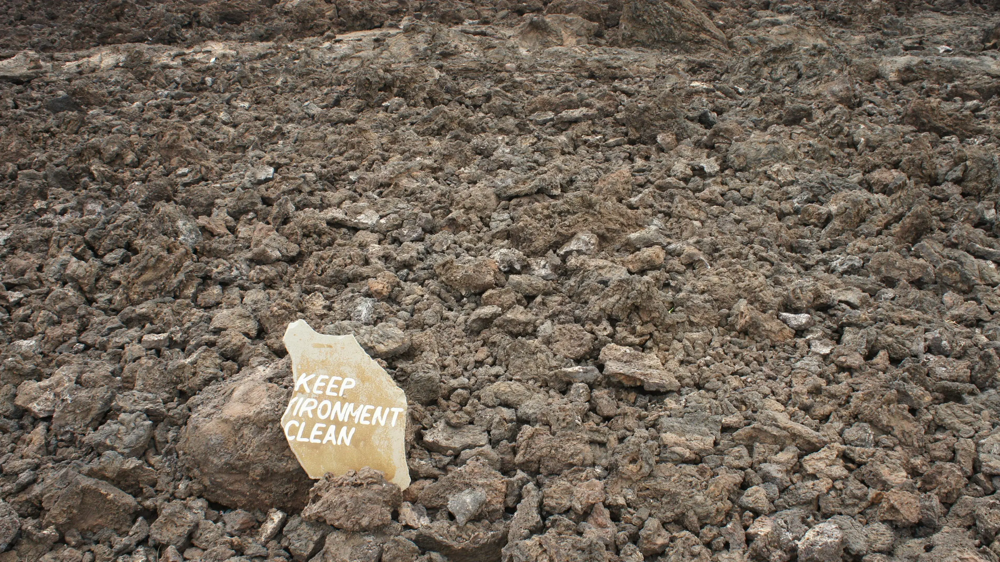
16:9: [FHD](16x9/1920x1080/FHD_KeepClean.jpg) [QHD](16x9/2560x1440/QHD_KeepClean.jpg) [4K](16x9/3840x2160/4K_KeepClean.jpg)
| 21:9: [UWFHD](21x9/2520x1080/UWFHD_KeepClean.jpg) [UWQHD](21x9/3360x1440/UWQHD_KeepClean.jpg)
| 16:10: [WUXGA](16x10/1920x1200/WUXGA_KeepClean.jpg) [WQXGA](16x10/2560x1600/WQXGA_KeepClean.jpg) [WQUXGA](16x10/3840x2400/WQUXGA_KeepClean.jpg)

### 17. Lango (gate, door, portal)
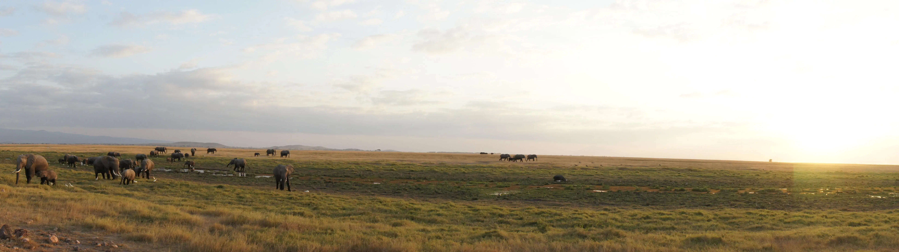
32:9: [6599x1856](32x9/6599x1856_Lango.jpg)

### 18. Lazima (necessity, responsibility, obligation)
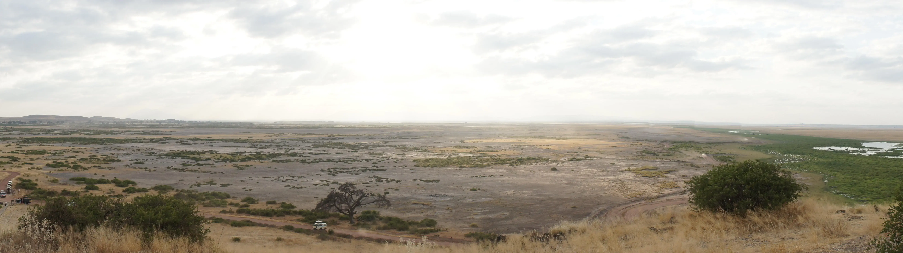
32:9: [6599x1856](32x9/6599x1856_Lazima.jpg)

### 19. Ekundu (red)
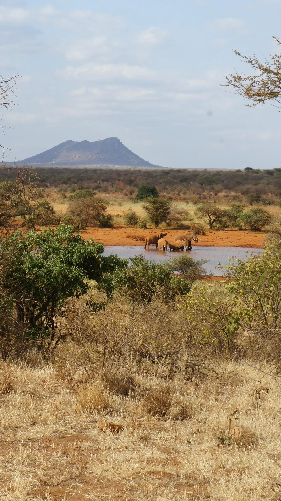
9:16: [FHD](9x16/1080x1920/vFHD_Ekundu.jpg) [QHD](9x16/1440x2560/vQHD_Ekundu.jpg) [4K](9x16/2160x3840/v4K_Ekundu.jpg)

### 20. Embamba (narrow, slim, or slender)
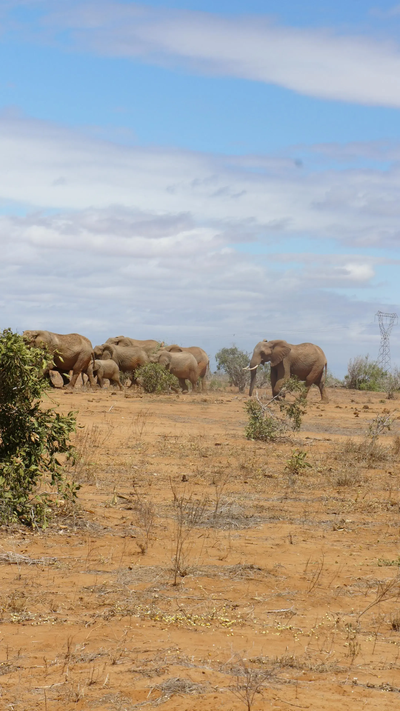
9:16: [FHD](9x16/1080x1920/vFHD_Embamba.jpg) [QHD](9x16/1440x2560/vQHD_Embamba.jpg) [4K](9x16/2160x3840/v4K_Embamba.jpg)

### 21. Endapo (in case)
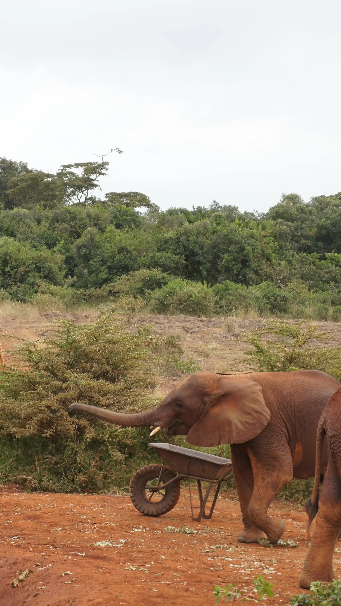
9:16: [FHD](9x16/1080x1920/vFHD_Endapo.jpg) [QHD](9x16/1440x2560/vQHD_Endapo.jpg) [4K](9x16/2160x3840/v4K_Endapo.jpg)

### 22. Endalevu (sustainable)
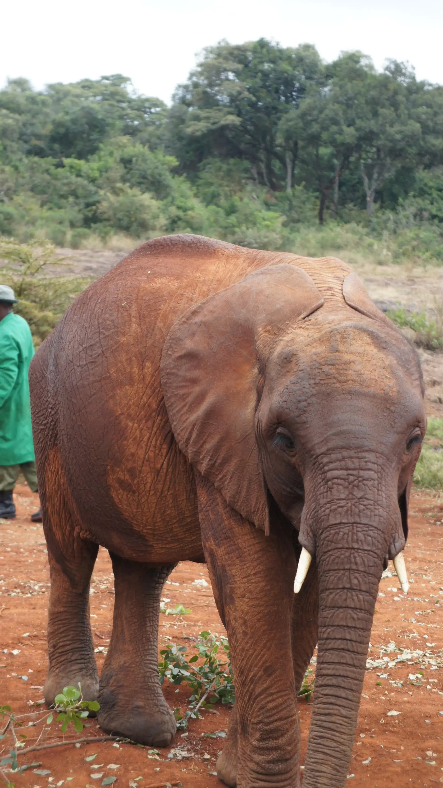
9:16: [FHD](9x16/1080x1920/vFHD_Endalevu.jpg) [QHD](9x16/1440x2560/vQHD_Endalevu.jpg) [4K](9x16/2160x3840/v4K_Endalevu.jpg)

### 23. Mwalimu (teacher)
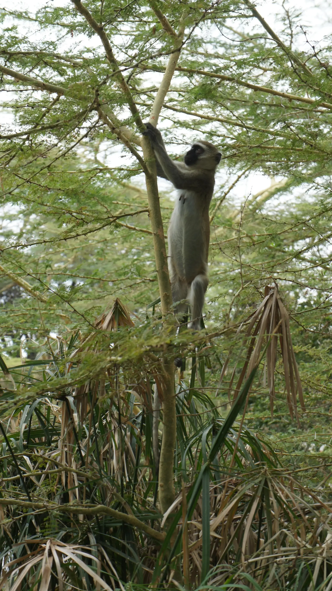
9:16: [FHD](9x16/1080x1920/vFHD_Mwalimu.jpg) [QHD](9x16/1440x2560/vQHD_Mwalimu.jpg) [4K](9x16/2160x3840/v4K_Mwalimu.jpg)
